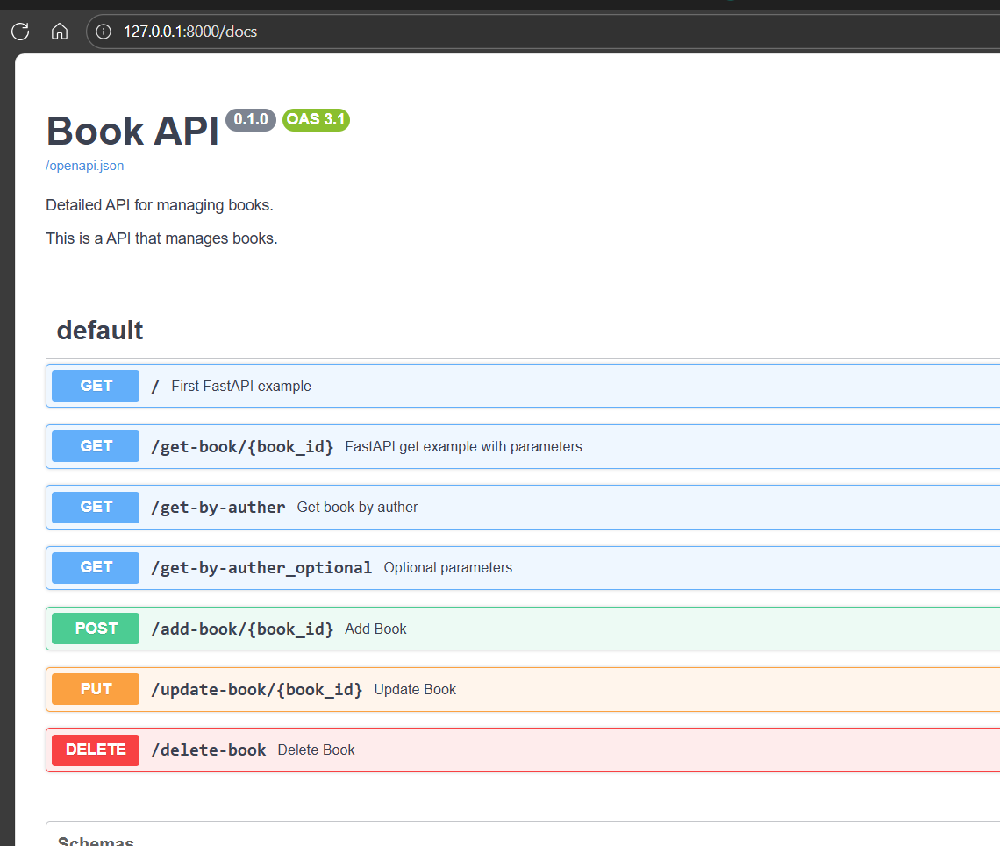

# Overview
The main objective of this repo is provide some quick API to connect to AI Foundry, using Azure App Services

## Requiriments

- docker
- Phyton 3.11
- azure accont
- az cli


## Configure .venv:
.venv creates isolated Python environments for each project, allowing you to install different package versions without conflicts.

Open Terminal on VS Code: 

PowerShell 
``` powershell
python -m venv .venv
.\.venv\Scripts\Activate.ps1

```
## Configure dependencies

On terminal, install Fast API

```bash
pip install fastapi
``` 
And ASGI Server

```bash
pip install uvicorn
```

## Test Local
Open a terminal and go to Phyton-Books folder

```bash
# Build da imagem
docker build -t books-api .

# Executar o container
docker run -p 8000:8000 books-api
```

Open http://localhost:8000/docs to open Swagger view and test API


1. Open /openapi.json to open OpenAPI json definition

## Push to Container Registry
```bash
# Login no Azure
az login

#random id
$resourceGroup = "apipy"
$ident = az account show --query id --output tsv
$ident += $resourceGroup
$bytes = [System.Text.Encoding]::UTF8.GetBytes($ident)
$md5 = [System.Security.Cryptography.MD5]::Create()
$hash = $md5.ComputeHash($bytes)
$randomIdentifier = ([System.BitConverter]::ToString($hash) -replace '-', '').Substring(0,7).ToLower()

# Criar um registry
$acrname = "$resourceGroup$randomIdentifier"

# Create Resource Group
az group create --name $resourceGroup --location brazilsouth

# Create Container Registry
az acr create --resource-group $resourceGroup --name $acrname --sku Basic 

$acrtag="$acrname.azurecr.io/books-api:latest"

# Push da imagem
az acr login --name $acrname

docker tag books-api $acrtag
docker push $acrtag
```

## Create App Services and deploy container
Follow This Steps to create a App Service, and point to recently create image in Azure Container Registry

https://learn.microsoft.com/en-us/azure/app-service/quickstart-custom-container?tabs=dotnet&pivots=container-linux-azure-portal


